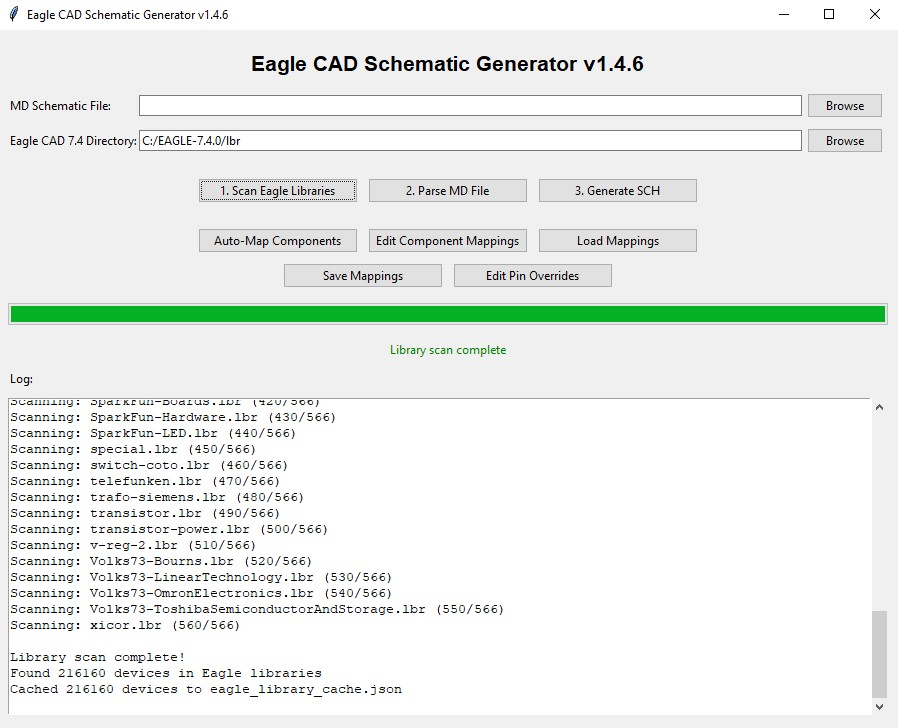
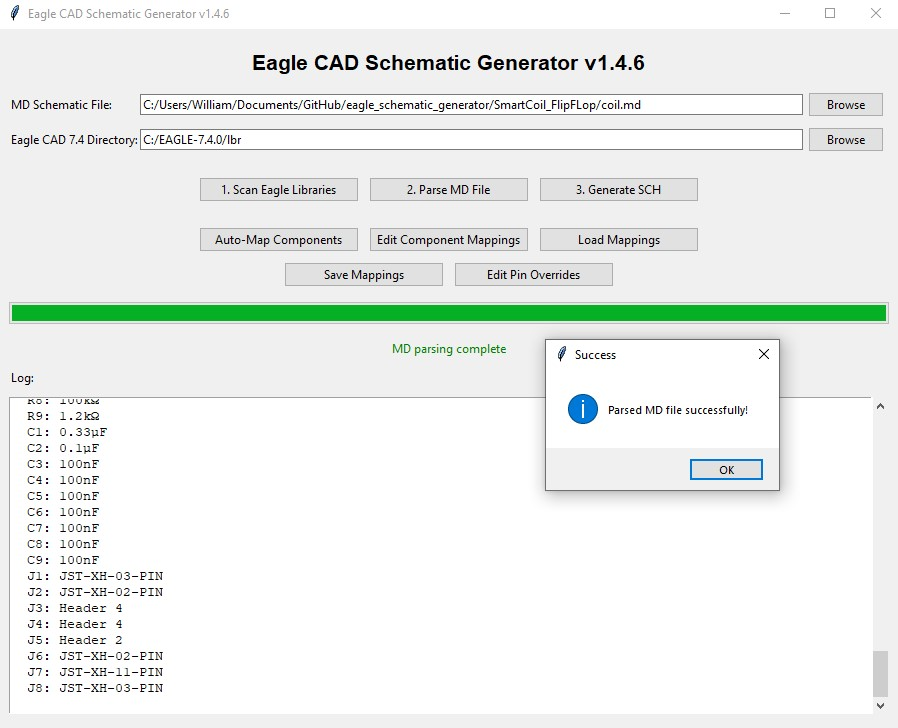
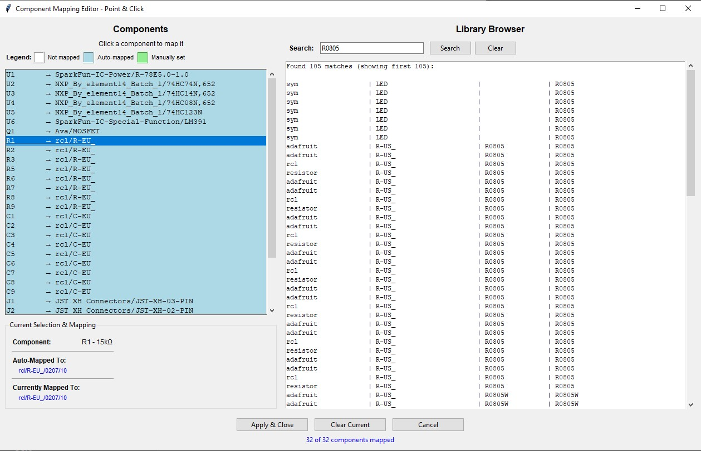
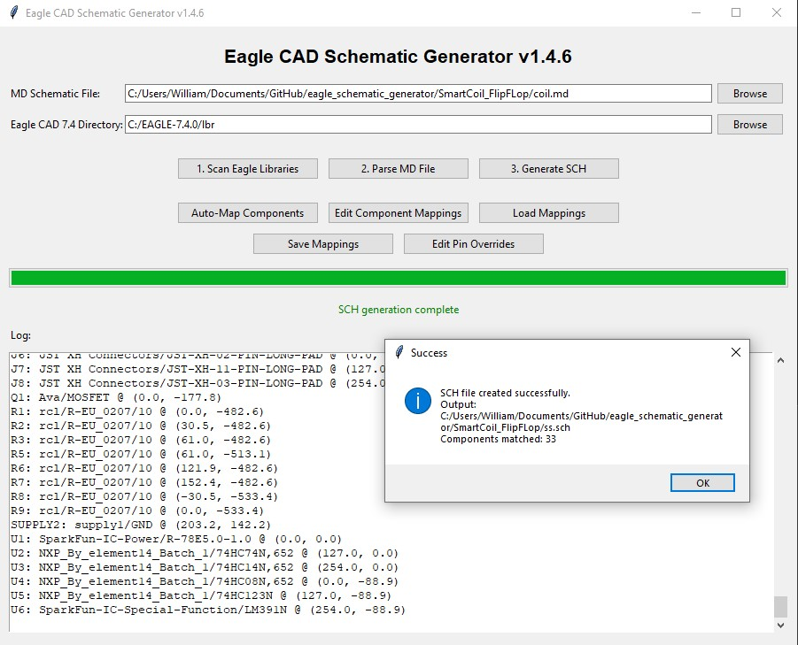

# Eagle CAD Schematic Generator

A Python tool that converts AI-generated Markdown schematic specifications into Eagle CAD schematic files (`.sch`) and scripts (`.scr`). Output is compatible with **Fusion 360 Electronic Design** and standard Eagle CAD workflows.

> **Prerequisites**: Basic knowledge of Eagle CAD schematic editors is required. You should be familiar with schematic symbols, nets, and how Eagle organizes components in libraries. This script produces editable schematics; you will need to review, adjust placement, and run DRC/ERC as needed in Eagle or Fusion 360.

---

This is a bare-bones alternative to services like Flux.ai. Take the premade AI prompt and paste it into any AI chatbot. The prompt contains specific instructions to make a properly formatted schematic MD file. This file is required for the script to generate the Eagle SCH.

## Overview

This script bridges text-based schematic descriptions (Markdown) with Eagle CAD. You can:

- Describe a circuit in a structured Markdown file
- Let AI assist in drafting the Markdown
- Auto-map components to Eagle library devices
- Generate an Eagle `.sch` file ready for use in Fusion 360 Electronic Design

The generated schematic is a starting point for further editing, layout, and manufacture.

---

## Requirements

- **Python 3.7+** (standard library only for core parsing; tkinter for GUI)
- **Eagle CAD library folder** — a directory containing Eagle `.lbr` library files. You need this before running the script. The script will scan this folder to match your Markdown components to library devices. **Fusion 360 (Windows)**: `%APPDATA%\Roaming\Eagle\lbr` (or `C:\Users\<YourUsername>\AppData\Roaming\Eagle\lbr`). Standalone Eagle typically uses an `lbr` folder in the Eagle install directory.
- **Eagle application** (or Fusion 360) — to open, edit, and use the generated schematic

---

## Installation

1. Clone or download this repository.
2. Ensure Python 3.7+ is installed and `tkinter` is available (usually included with Python on Windows/macOS; on Linux you may need `python3-tk`).
3. Point the script at your **Eagle CAD library folder** (see Requirements for Fusion 360 path; standalone Eagle typically has an `lbr` folder in its install directory).

No `pip install` is required for basic operation.

---

## Workflow

### 1. Scan Eagle Libraries

Before parsing a Markdown schematic, the script needs to index your Eagle library files. Click **"1. Scan Eagle Libraries"** and select the directory containing your `.lbr` files. The script will:

- Scan all `.lbr` files in that directory
- Build an index of devicesets and devices for component matching
- Cache the result for faster subsequent runs

---

### 2. Create or Edit the Markdown Schematic

Create a Markdown (`.md`) file that describes your schematic. The format uses:

- A **Bill of Materials (BOM)** table with Ref, Part Number, Value, Description, and Package
- **Component sections** for each reference (e.g., `### U1 - LM7805 5V Regulator`)
- **Pin-by-pin connections** using `Pin N (name): Net NAME ─── OtherRef.PinM` syntax

**Library awareness**: When designing your schematic, confirm that the parts you specify (ICs, connectors, passives, etc.) exist in your Eagle library folder. The script can only map components to devices that are present in the scanned `.lbr` files. If a part is not in your library, the auto-mapping will fail or choose a wrong substitute—check the library contents (e.g., via the Library Browser in the Edit Component Mappings dialog) before finalizing your Markdown.

See the included `AI_MD_SCHEMATIC_PROMPT.md` for instructions you can give to an AI model to generate compliant Markdown.

**Important**: AI is not flawless. Always review AI-generated schematic Markdown for:

- Correct pin numbers from datasheets
- Correct package types (DIP vs SOIC, etc.)
- Consistent cross-references (e.g., if U6.Pin10 connects to J7.Pin2, J7’s section must agree)
- Complete nets and no implied or missing connections

---

### 3. Parse MD File

Click **"2. Parse MD File"** after selecting your Markdown file. The script will:

- Extract components, connections, and nets
- Run cross-reference checks and report warnings (e.g., off-by-one pin mismatches)
- Populate the component list for mapping

Fix any parsing warnings in the Markdown before proceeding.

---

### 4. Auto-Map Components and Edit Mappings (if necessary)

Click **"Auto-Map Components"** to match each Markdown reference to an Eagle library device. The script uses part numbers, package hints, and value matching. Then:

- Review the mappings in **"Edit Component Mappings"**
- Correct any mismatches (wrong package, wrong part family, etc.)
- Save mappings for reuse

---

### 5. Generate Schematic

Click **"3. Generate SCH"** to produce the Eagle schematic. The script will:

- Deep-scan only the libraries used by your design
- Build the schematic XML structure
- Output a `.sch` file and optionally a `.scr` script

Open the `.sch` file in Eagle or Fusion 360 Electronic Design to refine placement, run ERC/DRC, and proceed to layout.

---

## Quick Reference: Workflow Summary

| Step | Action                                                                                     |
| ---- | ------------------------------------------------------------------------------------------ |
| 1    | Scan Eagle libraries                                                                       |
| 2    | Create or edit the Markdown schematic (use `AI_MD_SCHEMATIC_PROMPT.md` with AI if desired) |
| 3    | Parse MD file                                                                              |
| 4    | Auto-map components and edit mappings if necessary                                         |
| 5    | Generate schematic                                                                         |

---

## Output Compatibility

The generated schematic is designed to be compatible with:

- **Fusion 360 Electronic Design** (Eagle-based)
- **Autodesk Eagle** (standalone)
- Other Eagle CAD–compatible tools that accept `.sch` files

---

## Disclaimer

**This script is provided without warranty or guarantee.** Errors may exist in the script when creating schematics. Always:

- **Double-check your work** before fabrication or manufacturing
- **Verify pin assignments** against datasheets
- **Run ERC/DRC** in Eagle or Fusion 360
- **Review AI-generated Markdown** for correctness — AI is not flawless and can introduce pin, package, or connection errors

---

## AI-Assisted Workflow

The file `AI_MD_SCHEMATIC_PROMPT.md` contains instructions for prompting an AI model to generate a compliant Markdown schematic. Replace `<PROJECT_SPEC>` with your design details and ask the AI to produce the `.md` file. After generation:

1. Verify all BOM references and package types
2. Cross-check pin numbers and connection consistency
3. Ensure nets are fully and correctly specified
4. Parse in this script and resolve any warnings before generating the schematic

---

## File Structure

| File                           | Purpose                                   |
| ------------------------------ | ----------------------------------------- |
| `eagle_schematic_generator.py` | Main script (GUI and logic)               |
| `AI_MD_SCHEMATIC_PROMPT.md`    | Prompt template for AI-generated Markdown |
| `eagle_library_cache.json`     | Cached library index (auto-generated)     |

---

## Version

Current version: **1.4.6** (see `__version__` in the script).

---

## License

This project is licensed under the **MIT License** — see the [LICENSE](LICENSE) file for details.

The MIT License is recommended for this script because it is simple, permissive, and widely used. It allows commercial and non-commercial use, modification, and distribution with minimal requirements (preserve the copyright notice and license text). This encourages adoption and integration with other tools (e.g., Eagle, Fusion 360 workflows) without legal friction.

---

## Contributing

Contributions are welcome. Please ensure any changes preserve compatibility with Eagle CAD and Fusion 360 Electronic Design workflows.

## Help the cause

If you find this script useful, please contribute to my beer fund.

